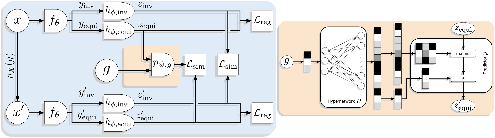

# Self-Supervised Learning of Split Invariant Equivariant Representations (SIE)

This repository provides the code for SIE (Split Invariant Equivariant), a JEPA based architecture to learn richer representations (that are equivariant) in the face of strong augmentations.

We also provide the dataset introduced in the paper, called 3DIEBench, as well as the code to generate and iterate on it.

Both SIE and 3DIEBench are described in our paper [Self-Supervised Learning of Split Invariant Equivariant Representations](https://arxiv.org/abs/2302.10283) published to ICML 2023.

Quentin Garrido, Laurent Najman, Yann LeCun

---



 


## Pretraining

We provide the code to reproduce the pretraining for every method in the paper:
- SIE : Rotations, Rotation + Color, without the variance on the predictor's output, with only the equivariant part
- SimCLR + AugSelf: Rotation and RotColor
- EquiMod: Classical method as well as a new VICReg based version
- General SSL: VICReg, SimCLR

The code is intended to work in a distributed setting and is made tu be used with SLURM compatible clusters.
It also contains an extensive online evaluation suite designed to help get signal on diverse tasks while the model is training. While they provide good indications on downstream performance, they shouldn't replace offline evaluations.

As an example, to pretrain SIE use the following command
```bash
python main.py --experience SIE --exp-dir EXP_ROOT/SIE --root-log-dir EXP_ROOT/logs/ --epochs 2000 --arch resnet18 --equi 256 --batch-size 1024 --base-lr 0.2 --dataset-root DATA_FOLDER --images-file ./data/train_images.npy --labels-file ./data/train_labels.npy --sim-coeff 10 --std-coeff 10 --cov-coeff 1 --mlp 2048-2048-2048 --equi-factor 0.45 --hypernetwork linear
```

Which can be wrapped for SLURM as follows:
```bash
sbatch --partition=PARTITION --job-name=SIE --nodes=1 --gpus-per-node=8 --cpus-per-task=N_CPUs --mem=MEM --time=48:00:00 --output=EXP_ROOT/SIE/log_%j.out --error=EXP_ROOT/SIE/log_%j.err --signal=USR1@60 --open-mode=append --wrap="srun python main.py --experience SIE --exp-dir EXP_ROOT/SIE --root-log-dir EXP_ROOT/logs/ --epochs 2000 --arch resnet18 --equi 256 --batch-size 1024 --base-lr 0.2 --dataset-root DATA_FOLDER --images-file ./train_images.npy --labels-file ./train_labels.npy --sim-coeff 10 --std-coeff 10 --cov-coeff 1 --mlp 2048-2048-2048 --equi-factor 0.45 --hypernetwork linear"
```
Adjusting parameters according to your cluster.


## Evaluations

We provide scripts to run all evaluations as follows:
- Classification: `eval_classification.py`
- Rotation predition: `eval_angle_prediction.py`
- Color prediction: `eval_color_prediction.py`
- Prediction error (PRE): `eval_prediction_errors.py`
- MRR and H@k: `eval_MRR_Hk.py`

They all are made to run on a single GPU.
Here are the sample commands to run to evaluate SIE

**Classification**

Equivariant part of the representations
```bash
python eval_classification.py --weights-file EXP_ROOT/SIE/model.pth --dataset-root DATA_FOLDER --exp-dir EXP_ROOT/eval/classif_linear-head_equi_SIE --root-log-dir EXP_ROOT/eval/logs/ --epochs 300 --arch resnet18 --batch-size 256 --lr 0.001 --wd 0.00000 --equi-dims 256 --device cuda:0
```
Invariant part of the representations
```bash
python eval_classification.py --weights-file EXP_ROOT/SIE/model.pth --dataset-root DATA_FOLDER --exp-dir EXP_ROOT/eval/classif_linear-head_inv_SIE --root-log-dir EXP_ROOT/eval/logs/ --epochs 300 --arch resnet18 --batch-size 256 --lr 0.001 --wd 0.00000 --equi-dims 256 --device cuda:0 --inv-part
```
Full representations
```bash
python eval_classification.py --weights-file EXP_ROOT/SIE/model.pth --dataset-root DATA_FOLDER --exp-dir EXP_ROOT/eval/classif_linear-head_all_SIE --root-log-dir EXP_ROOT/eval/logs/ --epochs 300 --arch resnet18 --batch-size 256 --lr 0.001 --wd 0.00000 --equi-dims 512 --device cuda:0
```

For all subsequent evaluations, the same arguments are used to evaluate parts of the representation, and as such we only give the command for the full representations for conciseness.

**Rotation prediction**

```bash
python eval_angle_prediction.py --experience quat --weights-file EXP_ROOT/SIE/model.pth --dataset-root DATA_FOLDER --exp-dir EXP_ROOT/eval/angle-prediction_mlp_all_SIE --root-log-dir EXP_ROOT/eval/logs/ --epochs 300 --arch resnet18 --batch-size 256 --lr 0.001 --wd 0.00000 --equi-dims 512 --device cuda:0 --deep-end
```


**Color prediction**

```bash
python eval_color_prediction.py --experience quat --weights-file EXP_ROOT/SIE/model.pth --dataset-root DATA_FOLDER --exp-dir EXP_ROOT/eval/angle-prediction_mlp_all_SIE --root-log-dir EXP_ROOT/eval/logs/ --epochs 300 --arch resnet18 --batch-size 256 --lr 0.001 --wd 0.00000 --equi-dims 512 --device cuda:0 --deep-end
```
**PRE, MRR, H@k**

For these evaluations, the following additional files are needed:
- [https://dl.fbaipublicfiles.com/SIE/all_latents_train.npy](https://dl.fbaipublicfiles.com/SIE/all_latents_train.npy) (112 MB)
- [https://dl.fbaipublicfiles.com/SIE/all_latents_val.npy](https://dl.fbaipublicfiles.com/SIE/all_latents_val.npy) (29 MB)

For out of the box compatibility, please download them in the `data` folder in this repository.

In the following commandes, the number of equivariant dimensions is AFTER the projector, since this is where the predictor is plugged.
```bash
python eval_prediction_errors.py --exp-dir EXP_ROOT/SIE --dataset-root DATA_FOLDER --equi-dims-reprs 512 --projector-mlp 1024-1024-1024
```
```bash
python eval_MRR_Hk.py --exp-dir EXP_ROOT/SIE --dataset-root DATA_FOLDER --equi-dims-reprs 512 --projector-mlp 1024-1024-1024
```


## Requirements

The code relies on:
- Pytorch
- Numpy
- Tensorboard for logging
- Scipy
- PIL
 
## Data generation: 3DIEBench

The dataset used in our work is available at [https://dl.fbaipublicfiles.com/SIE/3DIEBench.tar.gz](https://dl.fbaipublicfiles.com/SIE/3DIEBench.tar.gz) (17GB)

The code to generate it is in the folder `Data Generation`.
See the relevant ReadMe there for more details.

## License

All of the code in the present repository is released under GPL V3.0 License, which allows commercial use. See [LICENSE](LICENSE) for details.

The dataset is released under CC-BY-NC License. see [LICENSE](data/LICENSE) for details.


## Citation

If you find this repository useful, or use our dataset for your work, please consider giving a star :star: and citation:

```
@inproceedings{garrido2023sie,  
  title={Self-Supervised Learning of Split Invariant Equivariant Representations},
  author={Garrido, Quentin and Najman, Laurent and Lecun, Yann},
  booktitle={International Conference on Machine Learning},
  year={2023},
  organization={PMLR}
}
```