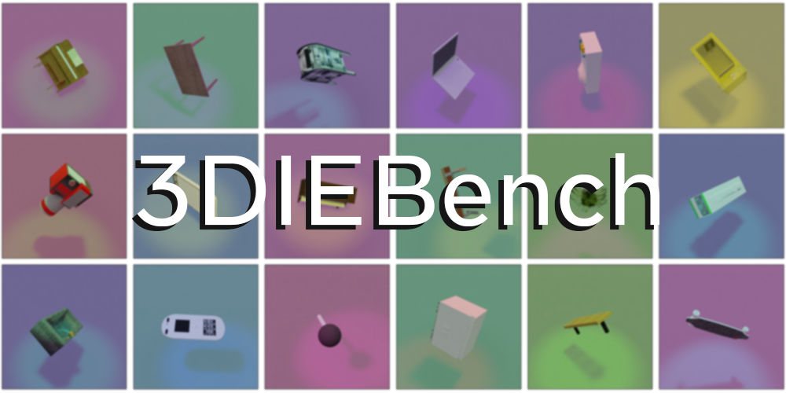

# 3D Invariant Equivariant Benchmark : 3DIEBench

This folder contians the code to generate 3DIEBench which is based on [BlenderProc](https://github.com/DLR-RM/BlenderProc).

## Dataset Description

The version of 3DIEBench used in our paper is available at [https://dl.fbaipublicfiles.com/SIE/3DIEBench.tar.gz](https://dl.fbaipublicfiles.com/SIE/3DIEBench.tar.gz) (17GB).

The dataset consists of 52,472 3d objects over 55 classes. Each are rendered  with 50 different latent configurations for a total of 2,623,600 images.
The models used are the same one as [ShapeNetCore v2](https://shapenet.org/) where we have only kept models from [3D Warehouse](https://3dwarehouse.sketchup.com/). As such, the code is compatible with ShapeNetCore v2 for ease of use.

The dataset is organized as follows
```
├── SYNSET_1                       
│   ├── OBJ_ID_1_1  
|   |   ├─ image_0.jpg
|   |   ├─ latent_0.npy
|   |   :
|   |   :
|   |   ├─ image_49.jpg
|   |   └─ latent_49.npy        
|   :
|   :       
│   └── OBJ_ID_1_N        
|   |   ├─ image_0.jpg
|   |   ├─ latent_0.npy
|   |   :
|   |   :
|   |   ├─ image_49.jpg
|   |   └─ latent_49.npy                
:
:              
├── SYNSET_55                       
│   ├── OBJ_ID_55_1  
|   |   ├─ image_0.jpg
|   |   ├─ latent_0.npy
|   |   :
|   |   :
|   |   ├─ image_49.jpg
|   |   └─ latent_49.npy        
|   :
|   :       
│   └── OBJ_ID_55_M        
|   |   ├─ image_0.jpg
|   |   ├─ latent_0.npy
|   |   :
|   |   :
|   |   ├─ image_49.jpg
|   |   └─ latent_49.npy              
└── LICENSE 
```


The latent files contain 9 values correspondig in order to:
- Rotation X  $\in [-\pi/2,\pi/2]  $
- Rotaiton Y $\in [-\pi/2,\pi/2]  $
- Rotation Z $\in [-\pi/2,\pi/2]  $
- Floor hue $\in [0,1]  $
- Light $\theta \in [0,\pi/4]  $
- Light $\phi \in [0,2\pi]  $
- Light hue $\in [0,1]  $

The 3d rotations are modeleds with Tayt-Bryan angles using an extrinsic frame.

## Dataset Generation

The code to generate the dataset can be used as follows:
```bash
blenderproc run main.py --models-path PATH_TO_MODELS  --output-dir DATASET_OUTPUT_DIR --objects ./all_objects.npy --views-per-object 50  --image-size 256 --seed 0
```

We estimate a runtime of around 500 hours on a single NVIDIA V100 GPU. However this can easily be parallelized on multiple GPUs so that each handles a subset of the object lists (by splitting `all_objcts.npy` into multiple ones). 

In this case **be careful to not have the same seed for different processes** to avoid generating the same transformations on multiple object sets.

## Citation

If you use this dataset or build upon it, please consider giving a star :star: and citation:

```
@inproceedings{garrido2023sie,
  title={Self-Supervised Learning of Split Invariant Equivariant Representations},
  author={Garrido, Quentin and Najman, Laurent and Lecun, Yann},
  booktitle={International Conference on Machine Learning},
  year={2023},
  organization={PMLR}
}
```